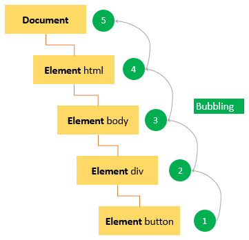

# Events

An event is an action or a state of any action performed either by the user or by the browser. An event can be triggered by the user or by the browser.
The browser triggers an event when the user interacts with the browser.
The user triggers an event when the user interacts with the webpage.

Each event may have an event handler which is a block of code that will execute when the event occurs. An event handler is also known as an event listener. It listens to the event and executes when the event occurs.

## How to Use Events?

You can use events by attaching event listeners to HTML elements. An event listener is a function, that listens for a specific event to occur on an element and then executes some code in response.

## How to assign events to DOM elements?

Use `addEventListener()` method and pass the event name and the event handler function as arguments. Write the code for an event inside the event handler function.

**_Example:_**

```HTML
<button id="btn" type="button">Clicl Me!</button>
```

```JS
const btn = document.querySelector("#btn");
btn.addEventListener("click", function () {
  alert("Button Clicked!");
});
```

## Events types

- Click events
- Mouse
- Keyboard
- Form
- Drag and drop
- Window
- Touch

## Event Flow

Event flow explains the order in which events are received on the page from the element where the event occurs and propagated through the DOM tree.

- Event bubbling
- Event capturing

**_Event bubbling_**

An event starts at the most specific element and then flows upward toward the least specific element (the document or even window).


